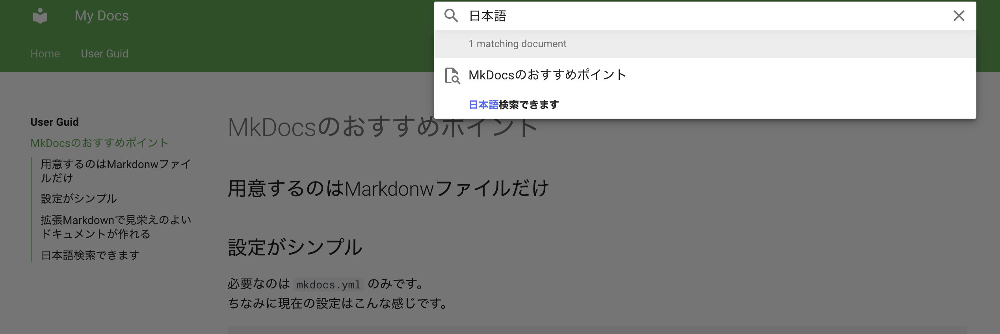

# MkDocsのおすすめポイント

## 用意するのはMarkdonwファイルだけ

Markdownファイルのあるディレクトリで設定ファイルを用意してコマンド実行するだけ。


## 設定がシンプル

必要なのは `mkdocs.yml` のみです。  
中身はこんな感じです。


``` yml
site_name: My Docs

theme:
  name: material
  palette:
    primary: green
  features:
    - navigation.tabs
    - navigation.section
    - navigatin.top
    - toc.integrate

plugins:
  - search:
      lang: ja

markdown_extensions:
  - toc:
      permalink: true
      slugify: !!python/name:pymdownx.slugs.uslugify_cased
  - admonition
  - pymdownx.superfences

nav:
  - Home: index.md
  - User Guid:
    - mkdocs-point.md

```


## 拡張Markdownが便利

例えば次のような強調表示が使えます。

!!! info
    こんな感じで強調できます。記法は次の通りです。

    ``` md
    !!! info
        こんな感じで強調できます
    ```

!!! note
    code blockを埋め込むこともできます

    ``` python
    # code blockを埋め込むこともできます
    def hello():
        print('hello')
    ```

!!! warning
    いろいろ種類があります


## 日本語検索できます

どこまで使えるかは不明ですが、ある程度検索できます。  
検索機能を自分でいじることも可能です。

